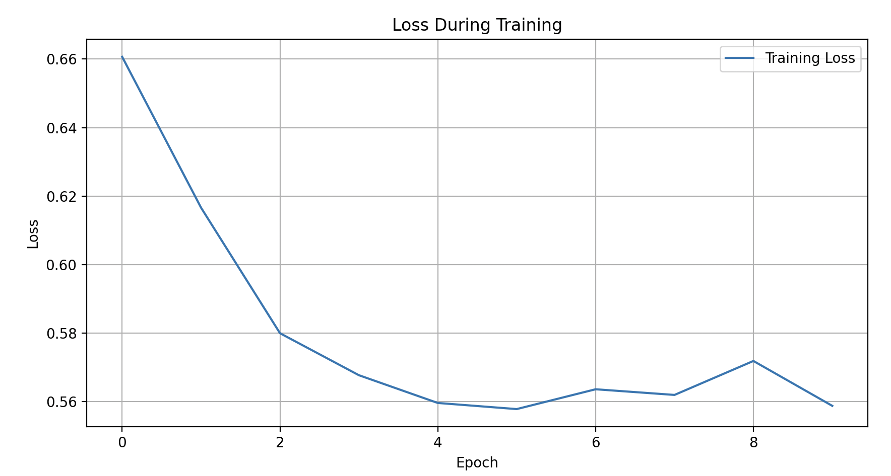
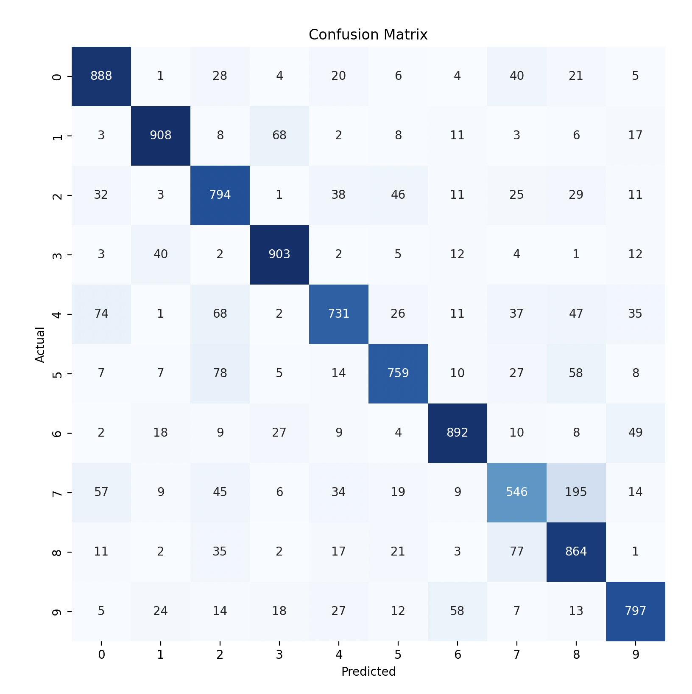

## CIFAR-10 Resnet Transfer Learning


This repository demonstrates the application of Transfer Learning using a pretrained ResNet model to classify 50.000 images from the CIFAR-10 dataset, which includes 10 classes and image dimensions of 32x32 pixels.


## Installation

[Download dataset](https://drive.google.com/file/d/1e8IbPE--6VVRl-nAi6DkA3H14GoGTYNm/view?usp=sharing)

To get started, clone the repository and set up the environment:

```bash
git clone <repository-url>
conda env create -f environment.yml
```

## Usage
Edit the training config in main.py

```python
config = {
    "epochs": 10,
    "batch_size": 32,
    "learning_rate": 0.001
}
```

run
```bash
python3 main.py
```

### Results

| Metric    | Value     |
|-----------|-----------|
| Accuracy  | 0.8184    |
| Precision | 0.8256    |
| Recall    | 0.8172    |

Chart of the loss over the training epochs



Confusion Matrix of the 10 different classes

{'frog': 0, 'truck': 1, 'deer': 2, 'automobile': 3, 'bird': 4, 'horse': 5, 'ship': 6, 'cat': 7, 'dog': 8, 'airplane': 9}




