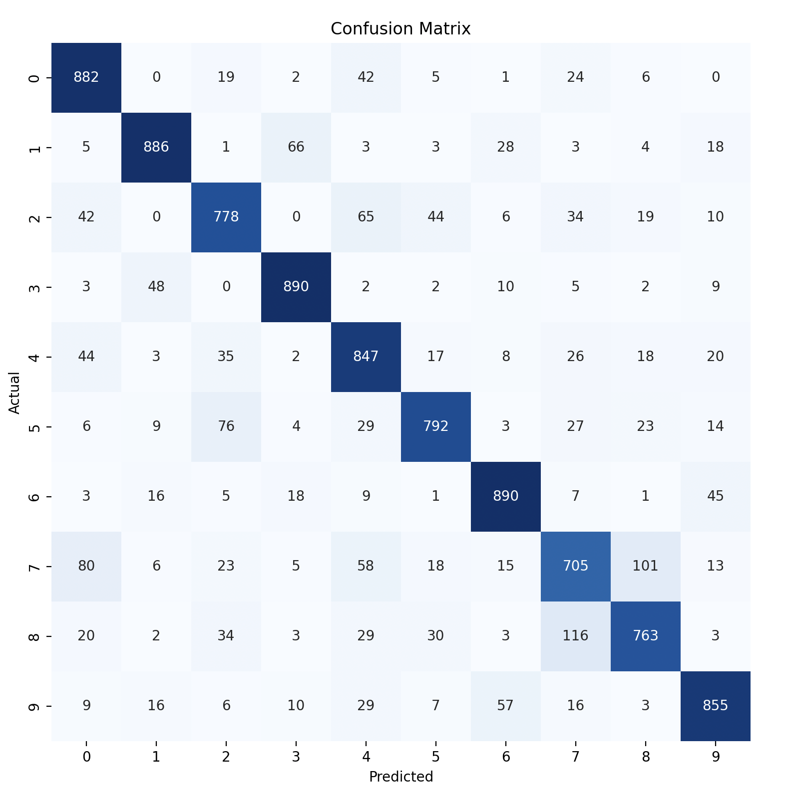
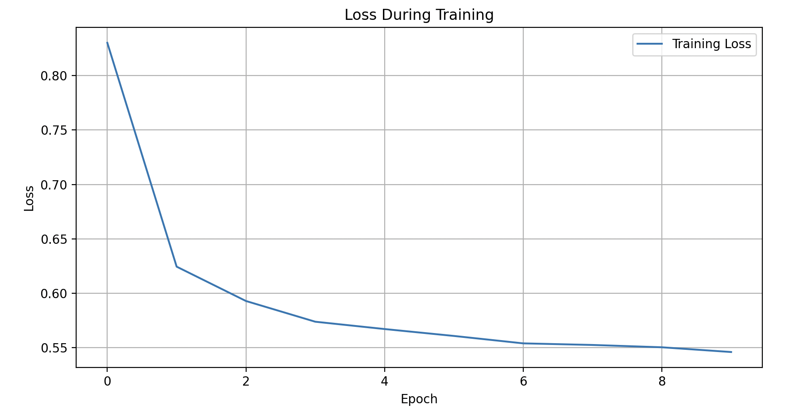

## CIFAR-10 Resnet Transfer Learning

- **Project Description:** This Repository uses Resnet 
- **Project Image:** Replace `` with the path to an image file within your repository that illustrates what the project does or how it looks. This could be a screenshot or a diagram.

- **Installation:** Instructions on how to clone the repository and install the required dependencies.
- **Usage:** A brief code example showing how to use your project or library.
- **Results:** This optional section can be used to display additional screenshots, code snippets, or explanations of more complex use cases.

This README is designed to be both informative and visually engaging, ensuring that anyone visiting your GitHub repository can quickly understand and start using your project.
